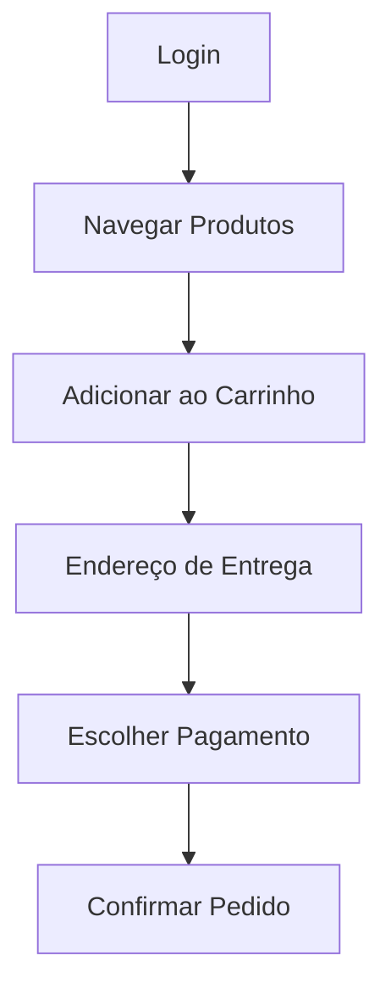

# Contexto Atual

### O aplicativo permite que usuários naveguem por produtos, adicione itens ao carrinho e finalize compras online. É essencial garantir que toda a jornada do cliente funcione perfeitamente, desde o login até a confirmação do pedido.

---

## 🧾 Contexto
Este documento apresenta o plano de testes baseado nos produtos digitais da **Daki**, considerEo o fluxo completo de compra tanto no **aplicativo mobile nativo** quanto no **site responsivo** (https://soudaki.com/shop). A proposta inclui distinções claras entre os testes para plataformas Mobile, Web e APIs, respeitEo as particularidades técnicas, comportamentais e de hardware de cada uma.

Sei que o contexto desse arquivo fala apenas do mobile, porem no app tem uma parte que faz integração web -> mobile então separei aqui os 3 escopos de testes.

---

## 📌 Fluxograma do Fluxo de Compra



---

# 🌐 Casos de Teste - Web
> Focados na jornada do usuário no site responsivo da Daki, via navegador, com base no fluxo real observado em https://soudaki.com/shop.

### 🔐 Acesso e Navegação de fluxos da pagina inicial
```gherkin
Cenário: Acessar página inicial
    Dado que o usuário acessa "https://soudaki.com/shop"
    Então a página deve carregar corretamente exibindo as seções Categoria, Aproveote Agora, Perguntas frequentes e um footer

Cenário: Selecionar um produto via campo de busca
    Dado que o usuário está na página inicial
    Quando pesquisa "Arroz"
    E deve visualizar uma lista de produtos de acordo com o que foi pesquisado
    E ao clicar no "+" do primeiro produto deve aparecer um formulario de endereço a ser preenchido
    Então que finalizo o formulario consigo adicionar um item ao carrinho

Cenário: Selecionar um produto via categoria
    Dado que o usuário está na página inicial
    Quando rola a pagina até a seção Categoria
    E seleciona a primeira categoria
    Então deve visualizar uma lista de produtos

Cenário: Selecionar um produto via seção Aproveite Agora
    Dado que o usuário está na página inicial
    Quando rola a pagina até a seção Aproveite Agora
    E seleciona o primeira item
    Então deve visualizar uma lista de produtos de acordo com o item selecionado
```

---

## 🛒 Adição ao Carrinho/ Endereço/ Pagamento

```gherkin
Cenário: Adicionar produto ao carrinho
    Dado que o usuário está na página inicial
    Quando pesquiso "Arroz"
    E clico em "+" no primeiro produto da lista
    Então deve aparecer o produto na sacola de compras

Cenário: Adicionar mais de um produto ao carrinho
    Dado que o usuário está na página inicial
    Quando pesquiso "Arroz"
    E clico em "+" no primeiro produto da lista
    E retorno a pagina e clico no segundo produto da lista
    Então deve aparecer os produtos na sacola de compras

Cenário: Efetuo o fluxo de pagamento
    Dado que o usuário está na página inicial
    Quando ja conte itens na sacola
    E clico na sacola de compras
    E valido o subtotal de acordo com os itens
    E clico em "Continuar para pagamento"
    Então deve aparecer uma box informEo para baixar o app com um QR code e um codigo.

Cenário: Endereço indisponivel
    Dado que o usuário está na página inicial
    Quando clica no endereço
    E seleciona um endereço estrangejeiro
    E deve aparecer uma box informEo que o endereço esta indisponivel.
    Então deve indisponibilizar o botao de COntinuar para o pagamento na sacola de compras.
```

---

# 📱 Casos de Teste - Mobile (App)

> Validações relacionadas à home do app nativo da Daki, com foco em navegação, interface e elementos interativos da lEing page principal.

## 🔐 Inicio
```gherkin
Cenário: Primeiro acesso
    Dado que o usuário acessa o app
    E deve aparecer um campo para digitar o endereço
    E digitamos um endereço valido
    Quando aparecer um formulario
    E preenchemos o formulario corretamente
    Então deve acessar o app corretamente

Cenário: Região indisponivel
    Dado que o usuário esta no app
    Quando selecionamos o campo de endereço
    E preenchemos com um endereço indisponivel
    Então deve aparecer uma mensagem de erro "Opa! Ainda não chegamos nessa região"

Cenário: Permissões de localizações
    Dado que o usuário esta no app
    Quando selecionamos o campo de endereço
    E clicamos em "Usar minha localização"
    E deve aparecer um box para confirmar a permissão de localização
    Então A localização deve estar correta

Cenário: Acesso mobile ao site (IOS)
    Dado que o usuário acessa "https://soudaki.com/shop"
    Quando escrola até o final
    E clicamos no icone da app Store
    Então devemos ser direicionados para baixar o app na app store

Cenário: Acesso mobile ao site (Eroid)
    Dado que o usuário acessa "https://soudaki.com/shop"
    Quando escrola até o final
    E clicamos no icone da Google Play
    Então devemos ser direicionados para baixar o app na Google Play Store
```
> **!!!!!! Cenario: Acesso mobile ao site (IOS) não esta funcionEo !!!!!**
> 
> 

---

## 🏠 Home 

```gherkin
Cenário: Exibir carrossel de promoções na home
    Dado que o usuário acessa a tela inicial do app
    Então deve visualizar um carrossel com banners promocionais roláveis horizontalmente

Cenário: Exibir seções de produtos personalizados por região
    Dado que o usuário está na home
    Então deve visualizar as seções "Populares na sua área", "Favoritos na sua região" e "Melhores para o seu dia" com produtos
  
Cenário: Acessar funcionalidade "Pedir novamente"
    Dado que o usuário está na home
    Quando clica no ícone "Pedir novamente"
    Então deve ser direcionado a uma tela com histórico de pedidos anteriores caso tenha

Cenário: Acessar funcionalidade "Indicar amigos"
    Dado que o usuário está na home
    Quando clica no ícone "Indicar amigos"
    Então deve aparecer a tela "Indique pra galera!"

Cenário: Responsividade dos elementos na home
    Dado que o usuário acessa o app em diferentes tamanhos de tela
    Então todos os botões e seções devem estar visíveis e navegáveis corretamente via scroll horizontal ou vertical
  
Cenário: Scroll vertical completo
    Dado que o usuário está na home
    Quando realiza o scroll até o final da página
    Então deve carregar todas as seções disponíveis, inclusive "Aproveite agora" e "Categorias"


```

---

## 🗂️ Seção Categorias - App Mobile
```gherkin
Cenário: Acessar tela de Categorias
    Dado que o usuário está no app
    Quando clica no ícone "Categorias" na navbar inferior
    Então deve visualizar a seção com Destaques e diversas categorias como "Próximos a vencer", "Destilados", "Vinhos" e "Cervejas"

Cenário: Acessar categoria "Destilados"
    Dado que o usuário está na tela de Categorias
    Quando clica em "Destilados"
    Então deve ser redirecionado para a lista de produtos dessa categoria
    E os produtos exibidos devem pertencer exclusivamente à categoria "Destilados"

```

---

## 🔍 Seção Busca - App Mobile
```gherkin
Cenário: Exibir campo de busca
    Dado que o usuário acessa o app
    Quando clica no ícone de "Busca" na navbar inferior
    E efetua uma pesquisa
    Então deve visualizar o que foi pesquisado
  
Cenário: Buscar produto inexistente
    Dado que o usuário está na tela de Busca
    Quando digita um termo inválido como "xyzabc123"
    Então deve ver uma mensagem indicEo que nenhum produto foi encontrado

```

---

## 📋 Seção Menu - App Mobile
```gherkin
Cenário: Acessar opção "Entrar ou fazer cadastro"
    Dado que o usuário está na tela inicial do app
    Quando clica no botão "Menu"
    E seleciona "Entrar ou fazer cadastro"
    E digita um telefone
    Então deve ser redirecionado para a tela de login ou cadastro

Cenário: Acessar suporte
    Dado que o usuário acessa o Menu
    Quando clica em "Suporte"
    Então deve ser redirecionado para uma tela de ajuda

Cenário: Visualizar "Termos de uso"
    Dado que o usuário está no Menu
    Quando clica em "Termos de uso"
    Então deve visualizar o conteúdo dos termos em um modal
  
Cenário: Visualizar "Política de privacidade"
    Dado que o usuário está no Menu
    Quando clica em "Política de privacidade"
    Então deve visualizar a política em um modal

Cenário: Ver horário de funcionamento
    Dado que o usuário está no Menu
    Quando clica em "Horário de funcionamento"
    Então deve visualizar os horários atualizados de entrega ou funcionamento das lojas
  
Cenário: Alterar idioma do aplicativo
    Dado que o usuário está no Menu
    Quando clica em "Idioma do aplicativo"
    Então deve poder selecionar entre os idiomas disponíveis
    E o idioma selecionado deve ser aplicado imediatamente no app

```
---

## 🛍️ Seção Sacola - App Mobile

```gherkin
Cenário: Sacola inicialmente vazia
    Dado que o usuário acessa a aba "Sacola"
    Então deve visualizar a mensagem "Sua sacola está vazia"
    E deve visualizar o botão "Adicionar itens"
    E deve visualizar o botão "Adicionar sacola montada no site"

Cenário: Redirecionamento ao clicar em "Adicionar itens"
    Dado que o usuário está na aba "Sacola" vazia
    Quando clica em "Adicionar itens"
    Então deve ser redirecionado para a tela de categorias

Cenário: Integração com sacola do site via código
    Dado que o usuário está na aba "Sacola" vazia
    Quando clica em "Adicionar sacola montada no site"
    Então deve visualizar um campo para inserir o código da sacola gerada no site

Cenário: Adicionar produto a partir da sacola
    Dado que o usuário está na aba "Sacola"
    Quando clica em "Adicionar itens"
    E seleciona a primeira categoria em destaque
    E busca o primeiro item na lista
    E clica no botão "+"
    Então o seletor de quantidade deve exibir o valor 1
    E o ícone da sacola deve indicar 1 item adicionado

Cenário: Visualizar item adicionado na sacola
    Dado que o usuário adicionou um produto
    Quando acessa a aba "Sacola"
    Então deve visualizar o produto, a quantidade e o subtotal corretos

Cenário: Limpar toda a sacola
    Dado que o usuário possui um ou mais itens na sacola
    Quando clica no ícone de lixeira no topo da tela
    E deve aparecer um modal perguntEo se deseja limpar toda a sacola
    Então ao clicar sim deve esvaziar a sacola
  
Cenário: Remover um único item da sacola
    Dado que o usuário possui múltiplos itens na sacola
    Quando ajusta a quantidade para zero ou clica no ícone de lixeira individual
    Então o item deve ser removido da sacola

Cenário: Iniciar pagamento a partir da sacola
    Dado que o usuário possui ao menos um item na sacola
    Quando clica em "Continuar"
    Então deve visualizar uma lista com sugestões adicionais de produtos
    E deve visualizar o botão "Continuar para o pagamento"

Cenário: Redirecionamento para login ao tentar pagar sem estar logado
    Dado que o usuário não está autenticado
    E possui itens na sacola
    Quando clica em "Continuar para o pagamento"
    Então deve ser redirecionado para a tela de login
    E deve visualizar um campo de telefone para validar cadastro

```
---

## Login e Cadastro
```gherkin
Cenário: Login com número de telefone válido
    Dado que o usuário acessa a tela de login
    Quando digita um número de telefone válido
    E clica em "Avançar"
    Então deve ser direcionado para a tela de código de verificação

Cenário: Número de telefone inválido
    Dado que o usuário digita um número de telefone incompleto ou inválido
    Quando clica em "Avançar"
    Então deve visualizar uma mensagem de erro clara e impedimento de prosseguir


Cenário: Código de verificação válido
    Dado que o usuário recebeu o código por SMS
    Quando insere o código corretamente
    Então deve ser direcionado para o formulário de cadastro (caso seja novo usuário)


Cenário: Código incorreto
    Dado que o usuário está na tela de verificação
    Quando insere um código errado
    Então deve visualizar mensagem de erro e possibilidade de reenviar o código


Cenário: Cadastro completo com dados válidos
    Dado que o usuário acessa o formulário de cadastro
    Quando preenche "Nome", "Sobrenome", "Email"
    E marca a caixa de aceite dos Termos e Política de Privacidade
    E clica em "Continuar"
    Então o cadastro deve ser concluído com sucesso e o usuário redirecionado para a Home

Cenário: Tentativa de cadastro sem aceitar termos
    Dado que o usuário preenche todos os dados do formulário
    But não marca a caixa de aceite
    Quando tenta continuar
    Então deve visualizar um alerta informEo a necessidade de aceitar os termos

Cenário: Formulário com campos vazios ou inválidos
    Dado que o usuário deixa campos obrigatórios vazios
    Quando tenta continuar
    Então deve receber mensagens de erro indicEo quais campos precisam ser corrigidos

```

---

## 🛒 Carrinho e UI Adaptativa
```gherkin
Cenário: Responsividade e touch
    Dado que o usuário acessa o app em um dispositivo com tela pequena
    Então os botões e inputs devem permanecer acessíveis e utilizáveis
```

---

## 💳 Pagamento Mobile
```gherkin
Cenário: Iniciar pagamento a partir da sacola
    Dado que o usuário possui ao menos um item na sacola
    Quando clica em "Continuar"
    Então deve visualizar uma lista com sugestões adicionais de produtos
    E deve visualizar o botão "Continuar para o pagamento"

Cenário: Redirecionamento para login ao tentar pagar sem estar logado
    Dado que o usuário não está autenticado
    E possui itens na sacola
    Quando clica em "Continuar para o pagamento"
    Então deve ser redirecionado para a tela de login
    E deve visualizar um campo de telefone para validar cadastro
  
Cenário: Falha de conexão no meio do pagamento
    Dado que o usuário preencheu dados do cartão
    E a conexão cai
    Quando tenta pagar
    Então deve receber aviso de erro e sugestão de nova tentativa

Cenário: Visualizar resumo dos itens da sacola na tela de pagamento
    Dado que o usuário clicou em "Continuar para o pagamento"
    Então deve visualizar os produtos escolhidos com nome, quantidade e subtotal corretos

Cenário: Inserir CPF para nota fiscal
    Dado que o usuário está na tela de pagamento
    Quando clica na seção de "Identificação no Pedido"
    E seleciona a opção "CPF"
    E preenche o número corretamente
    Então o campo deve ser salvo com sucesso e exibido na tela

Cenário: Verificar endereço de entrega
    Dado que o usuário chegou na tela de pagamento
    Então o endereço previamente informado deve ser exibido corretamente

Cenário: Selecionar tipo de entrega
    Dado que o usuário está na tela de pagamento
    Quando clica em "Receber em minutos"
    Então deve visualizar a previsão de entrega e valor associado

Cenário: Agendar entrega
    Dado que o usuário prefere agendar a entrega
    Quando seleciona a opção "Agendar"
    Então deve conseguir escolher data e horário disponíveis
  
Cenário: Selecionar forma de pagamento
    Dado que o usuário está na seção de pagamento
    Quando clica em "Selecionar forma de pagamento"
    Então deve visualizar as opções: Nubank, Apple Pay, Click to Pay, Cartão de Crédito e VR/VA

Cenário: Selecionar cartão de crédito válido
    Dado que o usuário escolhe "Cartão de Crédito"
    Quando informa os dados válidos
    Então o método deve ser salvo com sucesso

Cenário: Selecionar VR/VA
    Dado que o usuário possui vale alimentação ativo
    Quando escolhe a opção VR/VA
    Então o método deve ser aceito se disponível para o produto

Cenário: Adicionar contribuição para o entregador
    Dado que o usuário deseja contribuir com o entregador
    Quando seleciona um valor de gorjeta
    Então o valor deve ser adicionado ao total da compra

Cenário: Verificar totais do pedido
    Dado que o usuário está na tela de pagamento
    Então deve visualizar:
    - Subtotal dos produtos
    - Taxa de entrega
    - Valor da gorjeta (se houver)
    - Total geral correto

Cenário: Finalizar pedido com sucesso
    Dado que todos os dados foram preenchidos corretamente
    Quando clica em "Continuar"
    Então o pedido deve ser finalizado e o usuário redirecionado para a tela de status

```

---

## 🔔 Push e Permissões
```gherkin
Cenário: Permissão de notificação
    Dado que o app é aberto pela primeira vez
    Quando o sistema solicita permissão de push
    Então o app deve lidar corretamente com aceitação ou rejeição
```

---

# 🔌 Casos de Teste - API (Microserviço de Pagamento)

> Testes sugeridos para validar a integração e resiliência do microserviço de pagamento, baseado no comportamento do app e práticas comuns em sistemas de pagamento online.

```gherkin
Cenário: Token expirado ou inválido
    Dado que a requisição de pagamento contém um token JWT inválido ou expirado
    Quando o backend tentar autenticar a requisição
    Então a API deve retornar status 401 Unauthorized com mensagem "Token inválido ou expirado"

Cenário: Requisição sem autenticação
    Dado que a requisição não possui token
    Quando o backend processa a requisição
    Então deve retornar 403 Forbidden com mensagem de acesso negado

Cenário: Pagamento com cartão válido
    Dado que o cliente envia um payload válido com os dados do cartão e valor total
    Quando a API processa o pagamento
    Então deve retornar 200 OK com status "aprovado" e um ID de transação

Cenário: Cartão recusado por saldo insuficiente
    Dado que o cliente envia um pagamento com cartão válido mas sem limite
    Quando a API consulta o gateway
    Então deve retornar status 402 Payment Required com status "recusado"

Cenário: Pagamento via VR/VA indisponível
    Dado que o cliente escolheu VR/VA como forma de pagamento
    E os produtos da sacola não são elegíveis
    Quando a API valida a transação
    Então deve retornar 406 Not Acceptable com mensagem "Método não disponível para os itens selecionados"

Cenário: Timeout na comunicação com o gateway
    Dado que a API tenta comunicar-se com o gateway de pagamento
    E o tempo de resposta excede o timeout configurado
    Então deve retornar status 504 Gateway Timeout com fallback "aguardEo confirmação"

Cenário: Falha temporária do gateway
    Dado que o gateway está indisponível temporariamente
    Quando a API tenta processar o pagamento
    Então deve retornar status 503 Service Unavailable e registrar o pagamento como "pendente"

Cenário: Retentativa automática após falha
    Dado que a primeira tentativa falha por erro temporário
    Quando a retentativa é ativada internamente
    Então o pagamento deve ser reprocessado até 3 vezes antes de ser marcado como falha definitiva

Cenário: Payload com campos obrigatórios ausentes
    Dado que o cliente envia uma requisição sem os campos "card_number", "cvv" ou "amount"
    Quando a API tenta processar
    Então deve retornar 400 Bad Request com a lista de campos faltEo

Cenário: Valor da sacola divergente do front
    Dado que o valor enviado pelo cliente difere do calculado no backend
    Quando a API valida o pedido
    Então deve retornar 409 Conflict com mensagem "Inconsistência de valores detectada"

Cenário: Confirmação assíncrona via webhook
    Dado que o pagamento foi feito com sucesso no gateway
    Quando o gateway envia um webhook de confirmação
    Então o sistema deve atualizar o status do pedido para "pago" e notificar o usuário

Cenário: Falha no webhook de confirmação
    Dado que o webhook não chega após 60s
    Então o backend deve marcar o pagamento como "em análise" e disparar retentativa ou alerta manual

```

---

# 🧭 Classificação dos Cenários por Plataforma
## 🌐 Testes Web
- Login
- Carrinho 
- Pagamento 
- Histórico de Pedidos

## 📱 Testes Mobile
- Login com biometria

- Compatibilidade de UI

- Comportamento offline

- Permissões de push

# 🔌 Testes de API
- Pagamento válido, 
- recusado
- com erro
- timeout

---

# Justificativa
Decidi separar os testes por plataforma por garantir uma maior organização e foco no comportamento real de cada ambiente. O app mobile, por ser nativo, requer testes de hardware e permissões. Já o site web permite validar acessibilidade, responsividade e jornada em diferentes navegadores. Os testes de API asseguram resiliência e comunicação adequada entre sistemas críticos como o de pagamento.

Digo isso porque poderiamos considerar executar todos os testes em um mesmo ambiente e cenarios.

---

Além desses testes também temos os testes de exceção que esta no arquivo "testes_de_excecao.md".
