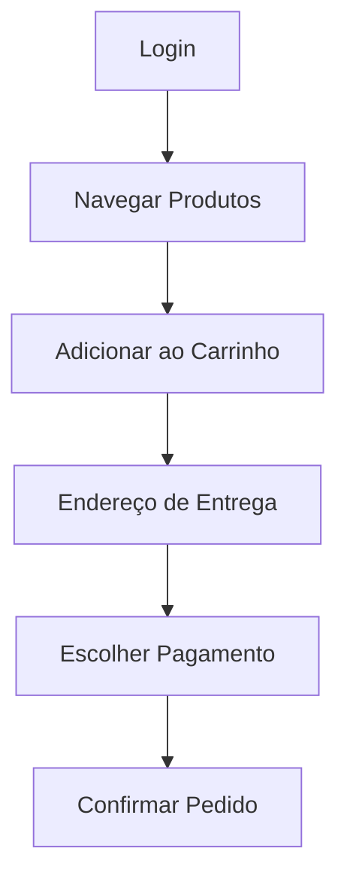

# 🧪 Plano de Testes Automatizados - Daki Challenge

### O aplicativo da Daki permite que usuários naveguem por produtos, adicionem itens à sacola e finalizem compras online. Este repositório contém a modelagem completa de testes automatizados, separada por plataforma (Web, Mobile, API), simulando a jornada real do cliente — do login até a finalização do pedido.

---

## 📚 Escopo

Este plano abrange três frentes de validação:

- **Web** – Fluxos via navegador responsivo em https://soudaki.com/shop
- **Mobile** – Funcionalidades do aplicativo nativo (iOS/Android)
- **API** – Testes de integração e resiliência para o microserviço de pagamento

As features estão organizadas na pasta `/challenge_features`:
- `/web` – Testes da plataforma web
- `/mobile` – Testes do app mobile nativo
- `/api` – Testes do microserviço de pagamento

---

## 📌 Fluxograma do Fluxo de Compra

## 🧭 Classificação dos Cenários por Plataforma
### 🌐 Web
- Login via telefone

- Navegação e busca de produtos

- Adição e remoção de itens da sacola

- Responsividade da UI

- Redirecionamento para download do app

### 📱 Mobile
- Primeira instalação e permissões

- Login/cadastro por telefone

- Scroll e comportamento adaptativo

- Funcionalidades como "Indicar amigos", "Pedir novamente"

- Tela de categorias, busca e menu

- Sacola e fluxo completo de pagamento

### 🔌 API
- Autenticação de token JWT

- Pagamentos bem-sucedidos e recusados

- Validação de payloads

- Timeout e falhas no gateway

- Webhooks de confirmação e fallback

## ✅ Justificativa da Separação por Plataforma
A separação por plataforma permite:

- Maior legibilidade e foco nas particularidades técnicas

- Melhor manutenção futura, já que o comportamento esperado pode divergir entre app nativo e web

- Clareza para execução segmentada dos testes conforme o ambiente (ex: CI/CD, staging, produção)

Embora fosse possível reunir todos os testes em um único conjunto, a divisão garante maior controle e cobertura granular.

E por isso organizei em arquivos feature utilizando o modelo gherking, para melhor entendimento até porque nem todo fluxo deve ser automatizado mas ja teriamos ua documentação.

---

# Plus
Como acabei identificando um possivel bug, resolvi trazer ele pra ca até como forma de adicionar como eu reportaria um bug.

# 🐞 Bug: Web detectado via Mobile

## Descrição
Ao acessar o site `https://soudaki.com/shop` via navegador mobile (iOS), o link da App Store no rodapé **não está funcionando** como esperado.

## Plataforma onde o bug foi detectado
- Mobile (Safari - iOS)

## Plataforma afetada
- Web (site responsivo)

## Comportamento esperado
Ao clicar no ícone da App Store, o usuário deveria ser redirecionado para a página do app na App Store.

## Comportamento atual
Ele apre a app store porem não encontra o app.

## Evidência
📸 Screenshot:  

## Status
Ainda reproduzível ✔️
